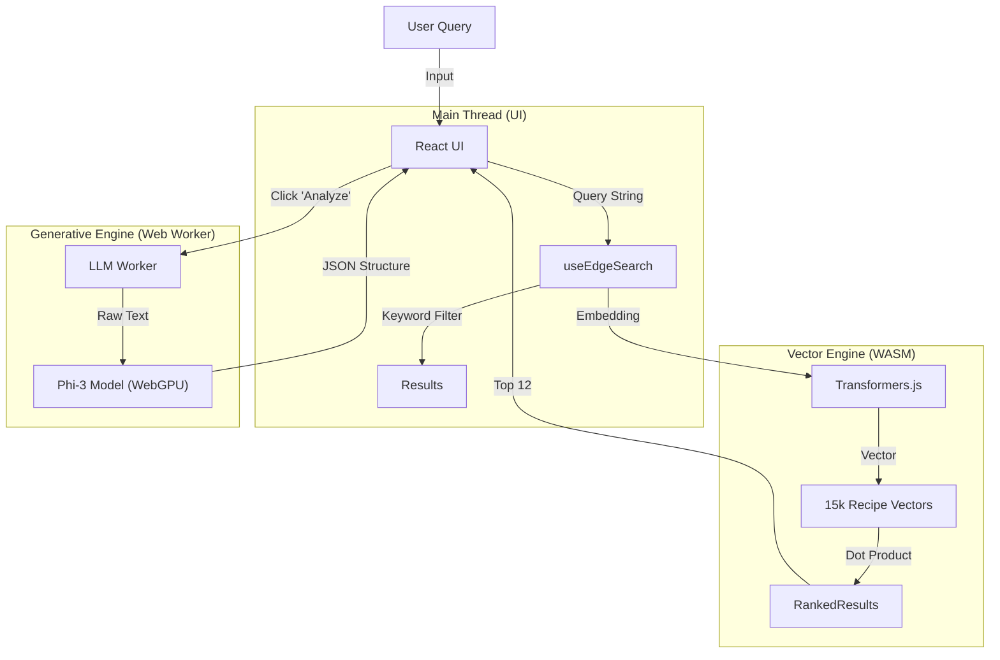

# AI Recipe Architect 🥗 
(Updated Edge version of the original RAG Recipe Engine)

### Serverless Hybrid RAG & Edge AI Culinary Platform

> **[🔴 View Live Demo](https://www.airecipebook.me/)**
> *Experience the full Serverless RAG architecture with zero backend latency.*

---

## 📖 Overview

**AI Recipe Architect** is a modern, privacy-first culinary platform that redefines how RAG (Retrieval-Augmented Generation) applications are built. Moving beyond traditional expensive backend architectures, this project implements a **Serverless Edge AI** model.

It solves the "Cold Start" and "Cost per Token" problems by shifting the intelligence to the client-side.

1. **Hybrid RAG Search:** Combines **Dense Vector Search** (using `all-MiniLM-L6-v2` locally) with **Metadata Filtering** (pre-computed tags) to provide instant, <50ms search results across 15,000+ recipes without hitting a server.
2. **Edge Generative AI:** A fully functional **Phi-3** LLM runs directly in the browser via WebGPU. When users need deep insights (e.g., "Is this Keto?"), the AI analyzes the raw recipe text locally to generate nutrition facts and summaries on demand.

### 🚀 Key Capabilities

* **⚡ Instant Hybrid Search:** A custom-built search engine that runs entirely in the browser memory. It merges **Vector Similarity** (Semantic Search) with **Keyword Boosting** to understand queries like "Spicy Chicken" vs. "Comfort Food."
* **🧠 Client-Side RAG:** Uses **WebLLM (Phi-3-mini)** to perform "Retrieval Augmented Generation" locally. It reads raw recipe data and "hallucinates" structured output (Nutrition, Prep Time) only when requested, saving massive compute costs.
* **📉 Zero-Latency UI:** Search results appear in milliseconds because the "Database" (a quantized binary index) is pre-loaded into the browser's `Float32Array` memory.
* **🕸️ Offline-First Architecture:** Once the 20MB model weights are cached, the entire application works offline. No API keys, no cloud bills, no tracking.
* **🎨 Fallback resiliency:** A robust UI that gracefully handles data gaps. "Raw" recipes show a blurred interface that invites the user to "Activate AI" to generate missing data, creating a seamless "Human-in-the-loop" experience.

---

## 🛠️ Tech Stack & Architecture

This project pushes the limits of the **Static Web**, proving that complex AI applications do not need complex backends.

| Component | Technology | Role |
| --- | --- | --- |
| **Frontend** | **React 18 + Vite** | Component-based UI with React Router for SPA navigation. |
| **Vector Search** | **Transformers.js** | Runs `Xenova/all-MiniLM-L6-v2` for query embedding generation. |
| **Gen AI** | **WebLLM (MLC)** | Runs `Phi-3-mini-4k-instruct` via WebGPU for text analysis. |
| **Data Layer** | **Binary Quantization** | Custom Python ETL pipeline converting 15k recipes into a 25MB binary index. |
| **Concurrency** | **Web Workers** | Off-loads the heavy LLM inference to a background thread to keep UI at 60fps. |
| **Deployment** | **GitHub Pages** | Pure static hosting with custom domain configuration. |

### System Architecture



---

## ⚡ Engineering Challenges & Decisions

### 1. The "Latency vs. Accuracy" Dilemma

**Challenge:** Using an LLM to "filter" search results (e.g., "Find Vegan recipes") took 2+ minutes because the model had to read every candidate.
**Solution:** Implemented a **Data Engineering Pipeline** (Python). I moved the classification step from *Runtime* to *Build Time*. A script pre-tags all 15,000 recipes with metadata (Vegan, Gluten-Free). Now, filtering is an instant `O(1)` array filter, while the LLM is reserved for deep analysis on the Details page.

### 2. Main Thread Blocking

**Challenge:** Loading the 2GB Phi-3 model froze the React UI, making the site feel "broken."
**Solution:** Architected a **Web Worker** implementation. The LLM runs in a totally separate thread. Communication happens via asynchronous message passing, ensuring the scrolling and animations remain buttery smooth even while the AI is crunching tokens.

### 3. The "Mixed Content" Image Problem

**Challenge:** The legacy dataset contained HTTP images, which modern browsers block on HTTPS sites (GitHub Pages).
**Solution:** Developed a **Smart Fallback Component** (`<RecipeImage />`). It attempts to load the image, catches the specific "Mixed Content" or 404 error, and instantly swaps it for a stylistic placeholder without breaking the layout.

---

## 📦 Installation & Setup

You can run the full AI stack locally.

### 1. Clone & Install

```bash
git clone https://github.com/your-username/ai-recipe-book.git
cd ai-recipe-book
npm install

```

### 2. Run Development Server

```bash
npm run dev

```

> Open `http://localhost:5173`. The app will auto-download the necessary models (approx 2GB) on the first run.

### 3. Data Pipeline (Optional)

The `public/data` folder already contains the pre-processed artifacts. If you want to rebuild the index:

1. Open the `etl/` folder (or provided Colab notebook).
2. Run the Python script to process raw JSON into `index.bin`.
3. Move outputs to `public/data`.

---

*Built & Refined by [Devansh Mistry](https://github.com/DevanshMistry890) — AI Engineer.*